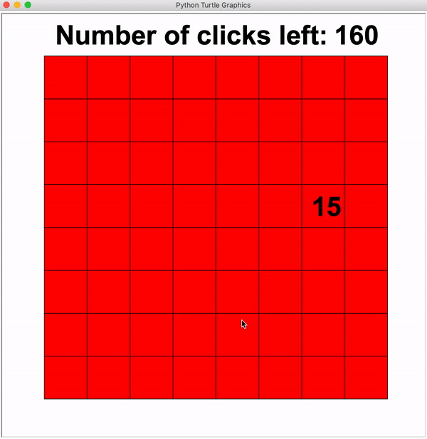
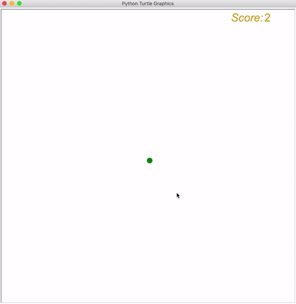
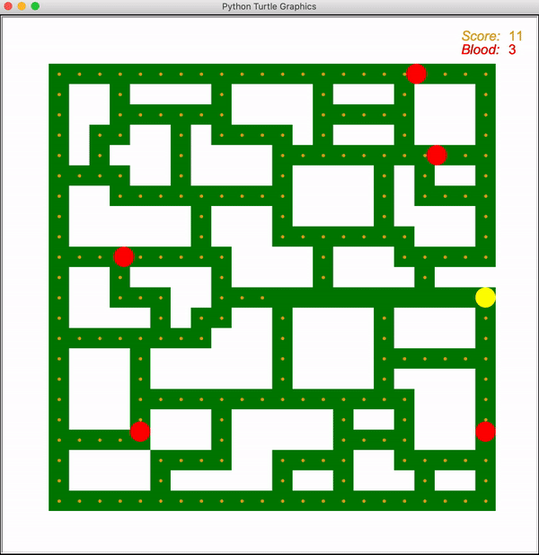

# Python-Games
This GitHub repository is for sharing codes and resources for my second book which aims at introducing Python, one of the top-five most popular programming languages in the world, to kids through developing live and colorful games. The book is planned to be published this October and will be sold through JD.com, Dangdang, Taobao, as long as local bookstores. If you have any questions when using the book, don't hesitate to contact me at raylibhsf@outlook.com!
### Here are some games you are about find in the book:
1. **Master of Memorization**:

A game testing your memorization. Click the tile to view the number corresponding to it. Destroy tiles by consecutively clicking two tiles with the same number. Use the least clicks to destroy all tiles.

2. **New Flappy Bird**:

Flappy-Bird inspired game. Click the screen to flap your wings. Watch out for black ravens as you fly across the screen.

3. **Eating Coins**:

Classic arcade game. Use the arrow keys to navigate and eat all the coins. Watch out for red ghosts that roam the maze.

